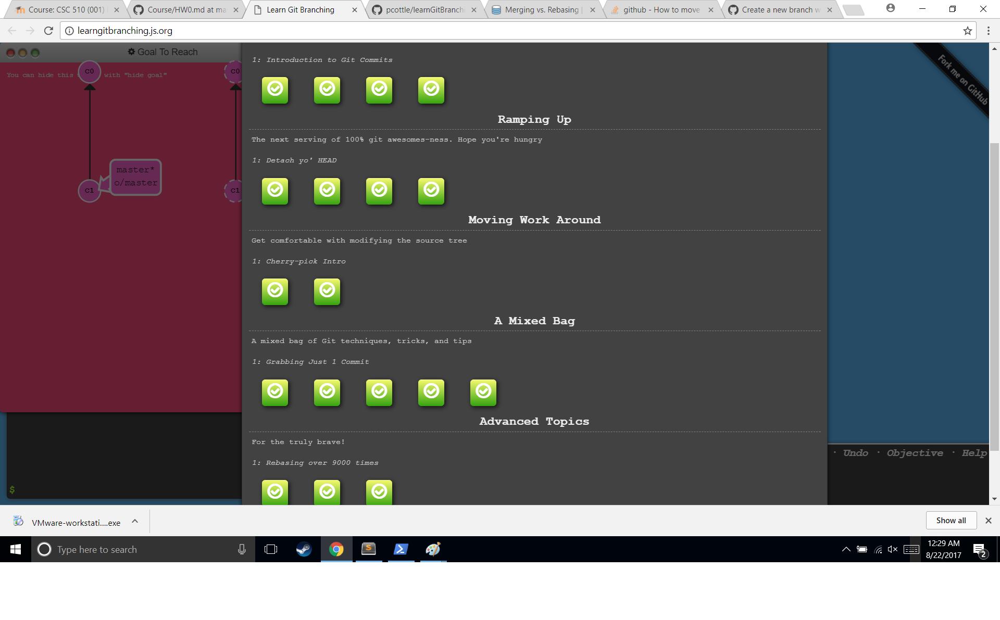

# HW0
Git exercise and Post-Commit Hook

### Profile Links
##### Moodle 
https://moodle-courses1718.wolfware.ncsu.edu/user/profile.php?id=117457
##### Slack
https://csc510-fall2017.slack.com/messages/C6QFZBTM5/team/arattili/
##### YouTube link for the Post-Commit tutorial:
https://youtu.be/p8Ikpuawov0

##### Git excercise completeion (With extra credit)

